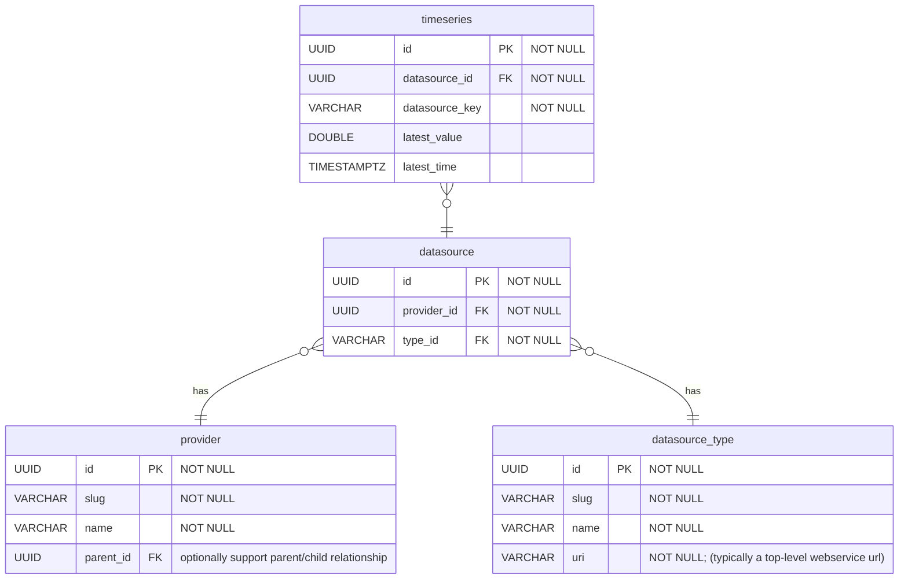

# Summary

Data models provide a conceptual, logical representation of real world concepts. They provide the foundation for data services and system interconnections. Foundational data models are shown below in the form of entity relationship diagrams. These models will grow and change to support additional requirements. We will aim to keep the data model documentation up to date.

# Timeseries Data

The goal of the timeseries data model a to provide a simple, flexible, multi-tenant capable storage solution. The model is predicated on the concept of a `provider`. Sample data will be shared below to help illustrate the concept; however, a `provider` roughly corresponds to a US Army Corps of Engineers office, another federal datasource (US Geological Survey), or any nameable entity that shares data that is aggregated into the Access to Water system.

## provider

_Who_ is providing the data.

The organization, office, or entity providing the data. For example, a provider could be "US Army Corps of Engineers St. Louis District".

##### Example Data

todo

## datasource_type

_What_ is being provided?

A distinct kind of data. For example, a datasource_type could be "Corps Water Management System (CWMS) Timeseries", with the `datasource_type.uri` being the top-level url for the CWMS RADAR (Restful web service) Timeseries endpoint.

> Note: This entity primarily captures "what", with a bit of "how" (uri field). This could end up being split into multiple entities in the future to eliminate repeated information, particularly in the `uri` field. Aiming to keep this as simple as possible up-front, following the [YAGNI principe](https://martinfowler.com/bliki/Yagni.html).

##### Example Data

## datasource

A unique combination of `provider` and `datasource_type`. This supports representing concepts like:

- The `provider` _USACE St. Louis District_ provides _Corps Water Management System (CWMS) Timeseries_ data
- The `provider` _US Geological Survey_ provides _USGS NWIS Instantaneous Values Timeseries_ data
- The `provider` _USACE Omaha District_ provides _Corps Water Management System (CWMS) Location Levels_ data

##### Example Data

todo

## timeseries

Summary metadata that applies to a collection of one or more `time`,`value` pairs. The `timeseries` entity does not actually contain the `time`,`value` pairs, only the name of the series and the latest time and value.

> Note: Most information can be represented as timeseries. As such, this model supports storage of static data, with the flexibility to capture changes over time if necessary.

##### Example Data

todo
