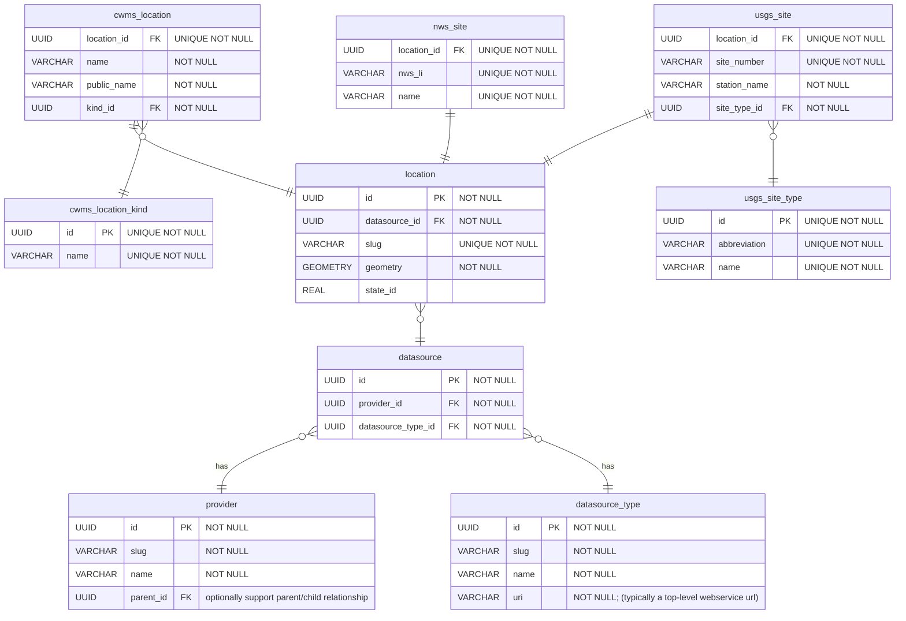

# Location

```mermaid
erDiagram

    cwms_location ||--|| location : ""
    cwms_location }o--|| cwms_location_kind : ""
    cwms_location {
        UUID        location_id  FK "UNIQUE NOT NULL"
        VARCHAR     name            "NOT NULL"
        VARCHAR     public_name     "NOT NULL"
        UUID        kind_id      FK "NOT NULL"
    }
    cwms_location_kind {
        UUID        id    PK "UNIQUE NOT NULL"
        VARCHAR     name     "UNIQUE NOT NULL"
    }
    usgs_site ||--|| location : ""
    usgs_site }o--|| usgs_site_type : ""
    usgs_site {
        UUID        location_id   FK "UNIQUE NOT NULL"
        VARCHAR     site_number      "UNIQUE NOT NULL"
        VARCHAR     station_name     "NOT NULL"
        UUID        site_type_id  FK "NOT NULL"
    }
    usgs_site_type {
        UUID        id            PK "UNIQUE NOT NULL"
        VARCHAR     abbreviation      "UNIQUE NOT NULL"
        VARCHAR     name              "UNIQUE NOT NULL"
    }
    nws_site ||--|| location : ""
    nws_site {
        UUID        location_id  FK "UNIQUE NOT NULL"
        VARCHAR     nws_li          "UNIQUE NOT NULL"
        VARCHAR     name            "UNIQUE NOT NULL"
    }
    location }o--|| datasource : ""
    location {
        UUID        id             PK "NOT NULL"
        UUID        datasource_id  FK "NOT NULL"
        VARCHAR     slug              "UNIQUE NOT NULL"
        GEOMETRY    geometry          "NOT NULL"
        REAL        state_id
    }
    provider {
        UUID    id         PK "NOT NULL"
        VARCHAR slug          "NOT NULL"
        VARCHAR name          "NOT NULL"
        UUID    parent_id  FK "optionally support parent/child relationship"
    }
    datasource_type {
        UUID   id     PK "NOT NULL"
        VARCHAR slug     "NOT NULL"
        VARCHAR name     "NOT NULL"
        VARCHAR uri      "NOT NULL; (typically a top-level webservice url)"
    }
    datasource }o--|| provider : has
    datasource }o--|| datasource_type : has
    datasource {
        UUID id                  PK "NOT NULL"
        UUID provider_id         FK "NOT NULL"
        UUID datasource_type_id  FK "NOT NULL"
    }

```
