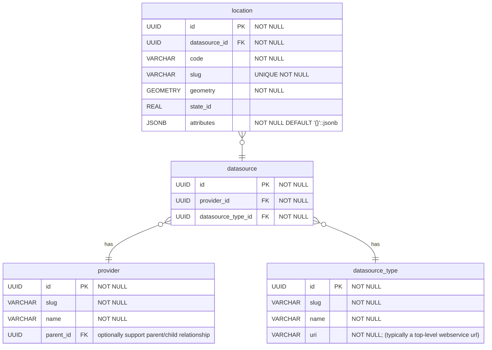

# Location

## Location.code

This captures a semi-unique value for each location within the domain of its underlying "datasource". A few examples showing how the `code` field is used are shared below:

- datasource_type 'usgs-site': `code` is the USGS station number, e.g. "05091500"
- datasource_type 'cwms-location': `code` is the CWMS Name, unique within the context of a US Army Corps of Engineers office, e.g. "Adamsville"
- datasource_type 'nws-site': `code` is the national weather service location identifier (nwsli), often referred to as the "handbook 5 code". e.g. "ASTM5"

## Location.attributes

The location table has a field `attributes` which supports a flexibility. Keys are allowed/denied based on the `datasource_type` associated with the location. This is controlled at the API layer, not by database foreign key constraints. Allowed keys are determined by the `datasource_type`, which is determined for a location through the `datasource_id` field. Keys that are allowed in the `attributes` field for each datasource_type are listed below. Allowed keys may be extended and modified in the future.

### Datasource Type: cwms-location

- public_name
- kind

### Datasource Type: nws-site

- name

### Datasource Type: usgs-site

- station_name
- site_type
