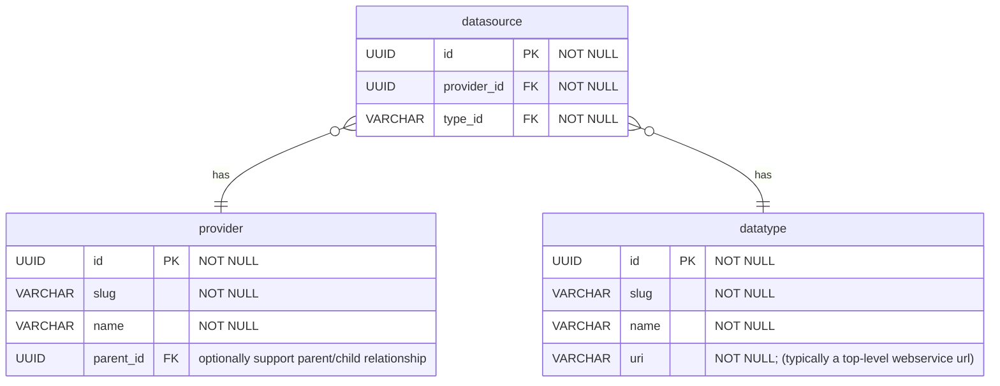

# Provider/Datasource Model

The broader water-api data model is predicated on the concept of a `provider`. Sample data will be shared below to help illustrate the concept; however, a `provider` roughly corresponds to a US Army Corps of Engineers office, another federal datasource (US Geological Survey), or any nameable entity that shares data aggregated in the Access to Water system.

## provider

_Who_ is providing the data.

The organization, office, or entity providing the data. For example, a provider could be "US Army Corps of Engineers St. Louis District".

##### Example Data

todo

## datatype

_What_ is being provided?

A distinct kind of data. For example, a datatype could be "Corps Water Management System (CWMS) Timeseries", with the `datatype.uri` being the top-level url for the CWMS RADAR (Restful web service) Timeseries endpoint.

> Note: This entity primarily captures "what", with a bit of "how" (uri field). This could end up being split into multiple entities in the future to eliminate repeated information, particularly in the `uri` field. Aiming to keep this as simple as possible up-front, following the [YAGNI principe](https://martinfowler.com/bliki/Yagni.html).

##### Example Data

## datasource

A unique combination of `provider` and `datatype`. This supports representing concepts like:

- The `provider` _USACE St. Louis District_ provides _Corps Water Management System (CWMS) Timeseries_ data
- The `provider` _US Geological Survey_ provides _USGS NWIS Instantaneous Values Timeseries_ data
- The `provider` _USACE Omaha District_ provides _Corps Water Management System (CWMS) Location Levels_ data

##### Example Data

todo
