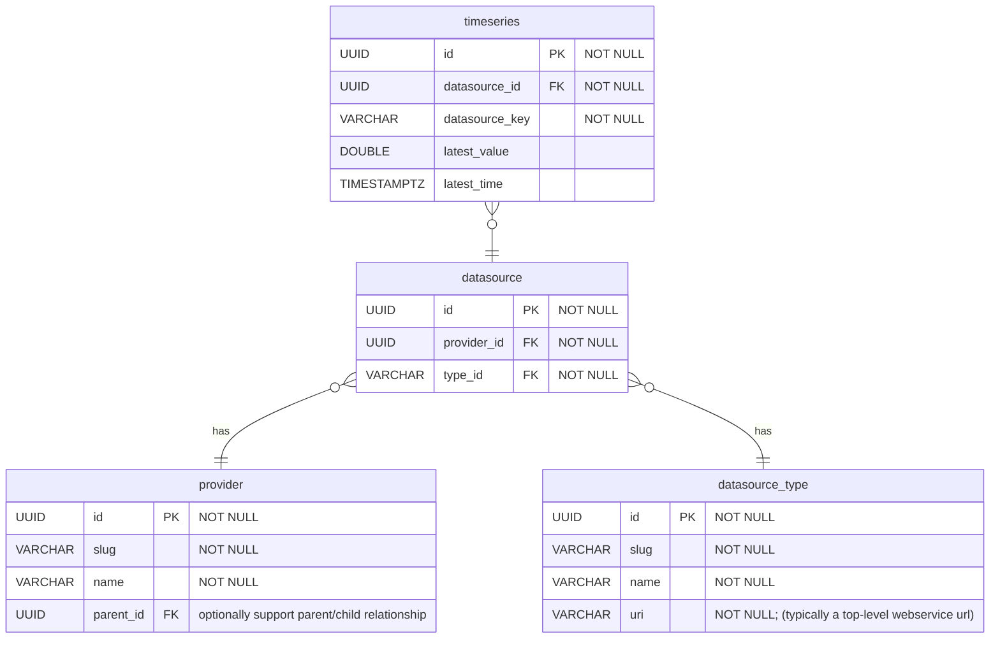

# Timeseries Model

The goal of the timeseries data model a to provide a simple, flexible, multi-tenant capable storage solution atop the core provider/datasource model. A timeseries consists of summary metadata that applies to a collection of one or more `time`,`value` pairs. The `timeseries` entity does not actually contain the `time`,`value` pairs, only the name of the series and the latest time and value.

> Note: Most information can be represented as timeseries. As such, this model supports storage of static data, with the flexibility to capture changes over time if necessary.

