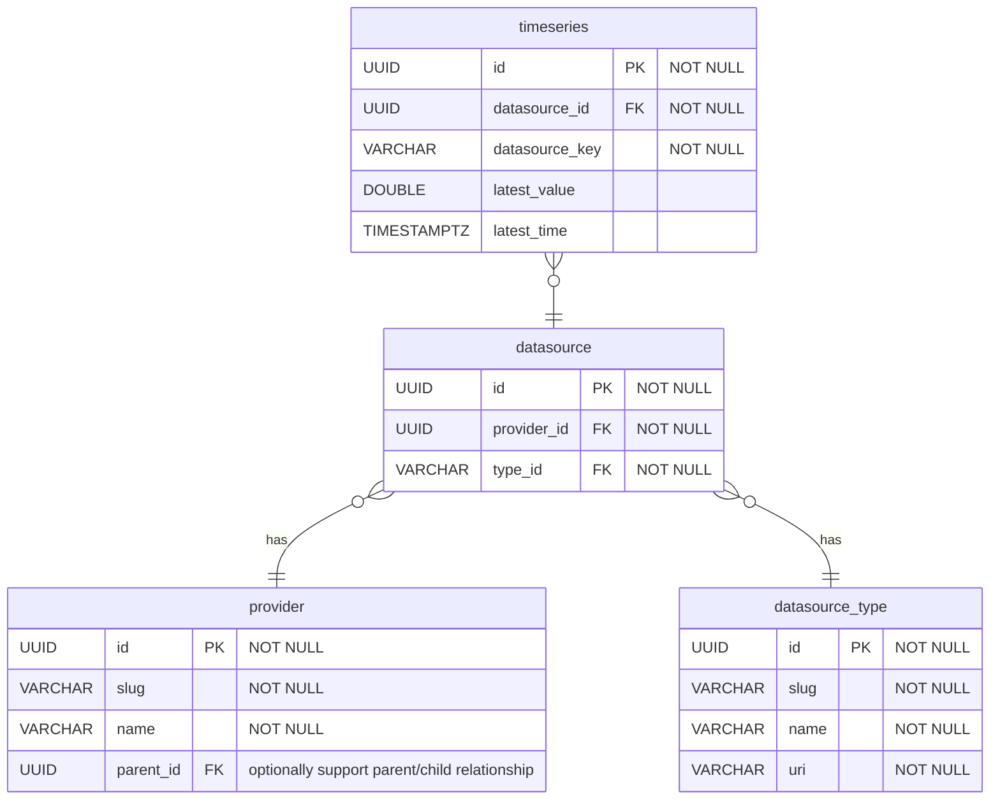
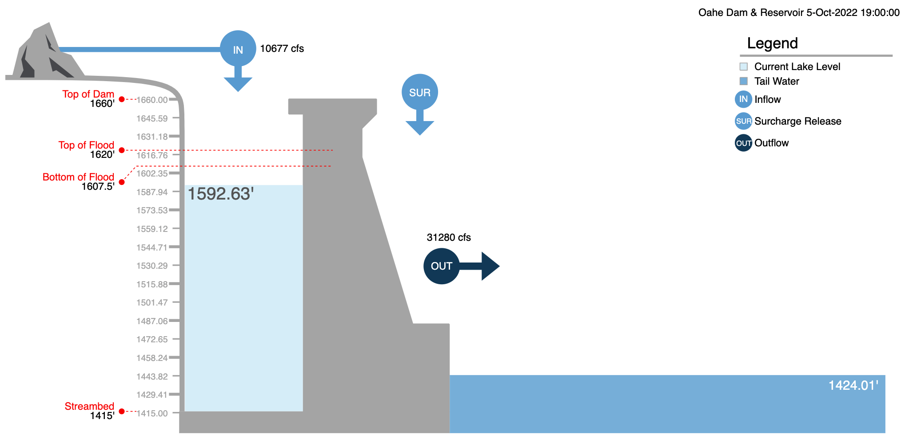

# Modernization

## Vision

> Access to Water is not a website. Access to Water is not a database.

Access to Water _is_ a collection of activities and technical capabilities focused on sharing water resource data with the public. This includes support for geospatial (mapping) links to data, models, and analytic methods ([WRDA 2007](/legislation?id=wrda-2007-november-2007)). These activities are to be accomplished within current appropriations (funding).

Modern data sharing inherently employs a wide range of very tangible technical capabilities, including websites, data storage solutions, data aggregation pipelines (ETL), data services, automation, data visualization, etc. Effective data sharing also requires less tangible coordination and integration efforts to address administrative, organizational, and technical silos. Access to Water activities will necessarily include both categories.

Because the objective is data sharing, the end goal and marker of success of the modernization effort is likewise improved data sharing, not _a new website_. An updated website will, however, be a key technical component and the primary technical entrypoint for the public.

The original Access to Water website and API services focus primarily on sharing the [Corps Water Management System (CWMS)](https://www.hec.usace.army.mil/cwms/) dataset. This dataset contains the location of US Army Corps of Engineers dams across the United states, their physical characteristics, and associated timeseries information about current and past conditions (water level, flow, nearby weather). Updating the means of sharing the CWMS dataset will be the starting point for modernization efforts to ensure feature and data parity. The modernized architecture will support storing and serving a broader scope of datasets in a modular way. After modernization, Access to Water data storage and RESTful data services will not be tightly-coupled with the existing CWMS database or technical architecture, allowing flexibility to incorporate and integrate other water resource datasets in a modular way.

## Technical Components

The following is a non-inclusive list of technical projects and capabilities to facilitate public data sharing and replacement of the original website and data services. Technical work for each component is managed using GitHub Issues at https://github.com/USACE/water.

### A Simple, Flexible, Multi-Tenant Model for Data Aggregation

### Web Application Programming Interface (API)

A HTTP web service to support data integration and sharing. This is the primary web service that will power the new website to be hosted at https://water.usace.army.mil.

Source code is available at https://github.com/USACE/water-api

### Public Website

(Work in Progress). A new website to be hosted at https://water.usace.army.mil.

Source code is available at https://github.com/USACE/water-ui

### Admin Website

A website to help internal Corps of Engineers personnel configure information, linkages, and metadata for public data sharing on the Public Website.

Source code is available at https://github.com/USACE/water-admin-ui

### D3 Chart Server

Visualization module for graphs and figures used in the Public Website and elsewhere. Initially created to reproduce the dam profile chart shown on the Public Website (example image below).

Source code is available at https://github.com/USACE/d3-chart-server.

### Airflow Data Pipelines

Data engineering pipleines synchronize and acquire data. The primary tool we use to accomplish this is [Apache Airflow](https://airflow.apache.org/).

Source code for particular workflows is available at https://github.com/USACE/airflow-config

### Automation of All Kinds

Technical integration and fast-paced development is enabled by automation and continuous integration/deployment (CI/CD). This section is a nod to the unseen automation components working hard behind the scenes.
